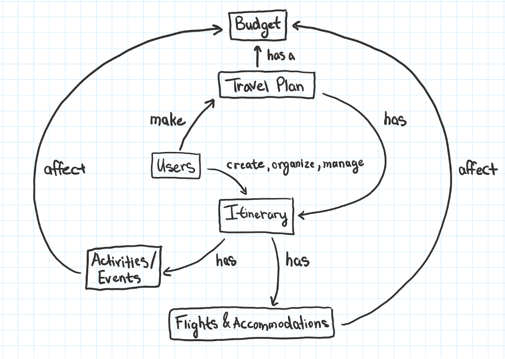

# TripMate Proposal

Travelling can be overwhelming. Between travel bookings, hotel reservations, suitcase packing, and planned trip activities, there’s a lot to consider and remember. Enter TripMate. By mixing organizational features with aspects of social networking, TripMate aims to be the one-stop-shop for everything needed to plan the perfect trip. 

TripMate’s organizational features include an itinerary, logbook, to-do list, budget tracker, and notification system. These features stand to help all travellers organization their plans in one location, which, ideally, will alleviate some of the stress of travelling. Additionally, a mobile app, designed with the understanding that internet access is not to be taken for granted when travelling, will ensure users’ travel plans will always be with them wherever they go. The itinerary will help users organize important events, the to-do list can help them prepare for those events, the logbook will enable them to write notes and memories alongside those events, while notifications will help ensure they do not forget anything. Additionally, the budget tracker will help keep frugal travellers, especially students, families, and businesses, from overspending.

When connected to the internet, users will have access to several other helpful features. For instance, a list of recommended events, organized by destination, will help users fill in their free time and add excitement and spontaneity to their travels. Furthermore, users will be able to share date-agnostic templates of their trips, which other travellers can copy and tweak to their liking. The primary goal of this feature is to reduce the amount of time it takes to plan a trip, and inspire other users to be more adventurous. Lastly, the ability to share exact travel plans with specific users will allow numerous users to seamlessly plan a trip together.

TripMate will distinguish itself from other similar products by integrating multiple aspects of travelling, such as itinerary organization, flight/accommodation scheduling, event recommendation, budget tracking, etc. into one seamless interface. Also, a unique focus will be placed on allowing users to share entire trips with others to foster a community within the application. Doing this will encourage users to share personal experiences related to destinations, events, etc. This information shall help travellers plan more informed trips, and may help destinations/businesses grow from feedback.

## Success Criteria

For this project to be considered a success in the simplest way, a user should be able to plan and organize a trip from start to finish. Flights, accommodations, and events should be logged in an itinerary and be easily viewed and used. In order to measure the success of our project, we will track the usage of the app during the users’ trips. It will be considered a success if our users access the app at least once a day during their trips. After their trips have ended we will poll our users for their ratings and consider it to be a success if we have a 4-star average rating. As an indicator of our user-base’s overall engagement, we will also consider the project to be a success if our community of users copy trips from one another at least 10 times each month. 

## Data Model Diagram

## Technical Discussion

### Mobile Application

We have chosen React Native as our mobile application technology stack. First of all, there is less work involved since we only need one code base for two different platforms. React Native compiles to native Java and Swift code for Android and IOS devices respectively. Specifically, it creates a bridge between web UI components and the native Java/Swift counterparts. Thus, there is no need for two development teams independently responsible for two platforms and no need to synchronize features and layouts. This will enable us to simply develop faster.

Secondly, React Native is easy to learn in a short amount of time. This is a huge benefit since this project requires us to be hands-on very quickly and start delivering a valuable product soon. Also, there is less specialized knowledge needed to create React Native apps. Considering that our group has more experience in JavaScript than Swift, even if we’ve never used React Native, with some self-education we can get up to speed quickly, especially if we’ve used React js already. All we need is a little time googling to find out which web components correspond with which mobile components, and then we’re all set.

Additionally, React Native works nicely with React js. Since we have chosen to implement our web client using React js, fragments of the frontend code can be shared between mobile and web, further facilitating the software development process.

Last but not least, there are lots of tutorials and videos about how to start a React Native app or resolve certain issues. This means we are less likely to get stuck indefinitely or consider switching to another language due to regret. 

In summary, being an easy to use framework that will require less work, has detailed documentation, and reduces stress when developing full stack with React js, React Native is a good option for us.

### Responsive Website

The tech stack our team has decided to use for the responsive web-site will consist of React js in combination with Redux for the front-end and Express.js for the back-end side of things. The motivation behind using React as our main front-end tool is due to the support and documentation Facebook provides. The React documentation is extremely easy to grasp, even having a walkthrough of how to create a small React application, highlighting all the main concepts of the framework. Hand-in-hand with documentation is the vast community support, with the Github repository having over 1300 contributors and a large community helping to address common questions on Stack Overflow.

Furthermore, starting a React project requires very little start-up time as Facebook has put together a Node module called create-react-app that will get us started by simply running a single command. Additionally, in order to be successful in this project, we will need to develop in an efficient manner. React js helps on this front with the ease of modularization. React is highly focused on creating reusable components within the system, allowing us to generalize our UI components and reuse them across our application.

We have decided to pair Redux with React for our front-end. The main motivation behind this is the ease of managing state. With React’s ability to turn the UI various components, managing the state can become difficult if not impossible as the application grows. Using Redux will allow us to manage our state from a top-level centralized place, ensuring we have one source of truth when dealing with manipulating and displaying our data to the users. Redux also works well for a RESTFUL API design, which we plan to use as the architecture for our backend.

Finally, we have chosen Express.js as the framework for our back-end server. The reasoning behind this choice is that it abstracts away a lot of the low-level details that we are not concerned with for this project. We are able to quickly specify API routes with a robust set of features for web applications. Express and a RESTFUL architecture go hand-in-hand with express providing a plethora of HTTP utility methods and middleware for quick back-end development. Express is also a Node js framework giving us the opportunity to take advantage of the millions of community-made node modules to aid in our development. Lastly, Express.js has a low learning curve with the added benefit of having tons of examples in their documentation, likely allowing us to spend less time learning the framework and more time on feature development.

### Database

For our database layer, we have elected to use the NoSQL database, MongoDB. The primary motivation in using Mongo is how quick it is to get running and use. Like the rest of the technologies previously discussed in this document, MongoDB is included in the Node Package Manager. A simple ‘npm install mongodb’ will allow us to add MongoDB, abstracting any other installation needs. Once a new developer starts working with the project an npm build will install all tech stack dependencies - all they need is Node on their computers. In terms of use, MongoDB does not store/retrieve values in the table/column/row model of a relational database.  Instead, MongoDB stores data in flexible, JSON-like documents. The benefit of this approach is objects are mapped directly to application code, making data easy to work with and easy to scale. 

One feature we are looking to implement is providing the user with recommendations on places to eat/shop and events to see. Geospatial queries on SQL databases can be very challenging because of how fast/often data can change. MongoDB has built-in geospatial features, allowing for our app to be responsive to changes in user location without using excessive resources from our server.

MongoDB is highly documented and has many tutorials online. In the event we get stuck or do not know where to start we can quickly refer to said documentation and tutorials. This will reduce our time playing around or researching for fixes.

## Important Links

Our GitHub repository is https://github.com/ahmedkidwai/Tripmate, and a full list of our user stories, including the MVP, can be found on Trello board Soft Eng 2 (https://trello.com/b/1zp3CPC3/soft-eng-2).
